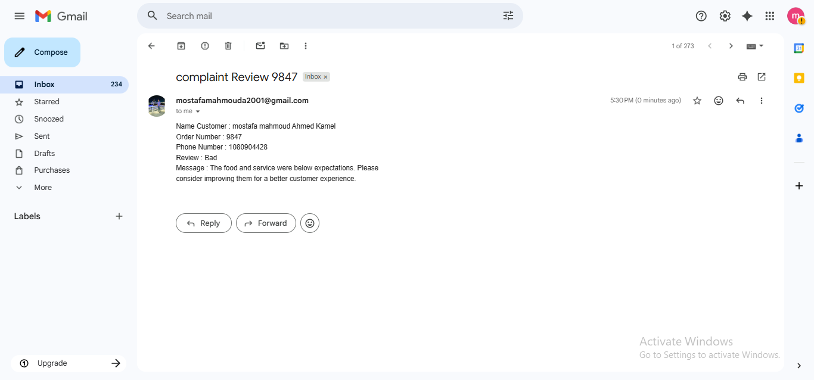

A modern and automated web application for collecting and managing restaurant reviews.
🚀 Overview
This app allows users to submit their feedback about a restaurant, and the system automatically stores the data, processes it, and sends notifications based on the type of review.

🖼️ Main Form

📨 Review Message Example

⭐ Features
Users can submit reviews containing:
- ID
- Name
- Phone
- Email
- Review Type (Excellent / Good / Bad)
- Message

**Stores all reviews automatically in Airtable**

**Sends email notifications for Good or Bad reviews**

Integrates with n8n automation to process and route reviews

🛠️ Tech Stack
n8n – workflow automation & email triggers
Airtable – cloud database
Gmail API – email notifications
HTML / CSS / JS – UI form
JSON – data formatting

Optional integration: GitHub LFS for media files

📡 Workflow (n8n)

- Form submission → Sent to n8n
- n8n validates inputs
- Saves the record in Airtable
- Sends email notification based on review type
- Logs the activity for analytics
